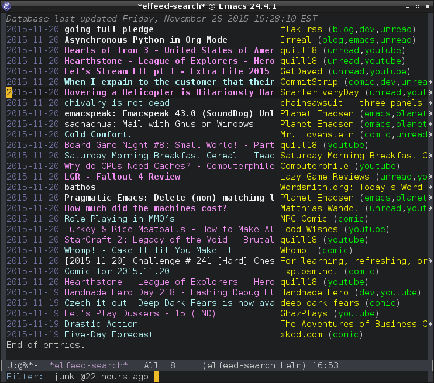

## Bonjour cher lecteur, utilisez-vous un flux RSS ?

Les flux RSS sont un moyen pratique de rester informé des dernières actualités dans les sites webs que vous préférez pour effectuer vos veilles technologiques. Si vous êtes un utilisateur de GNU Emacs, vous pouvez utiliser le package Elfeed pour lire vos flux RSS directement dans l'éditeur. Dans cet article, je vous présente Elfeed et je vous montre comment l'utiliser pour suivre l'actualité générale en ligne.

## Qu'est-ce que Elfeed

Elfeed est un package Emacs qui permet d'agréger et de lire des flux RSS et Atom. Contrairement à d'autres agrégateurs RSS, Elfeed est intégré à Emacs, ce qui signifie que vous pouvez l'utiliser sans quitter votre environnement de travail habituel. Il dispose de fonctionnalités avancées telles que:  

- la recherche de contenu;
- la gestion de marque-pages;
- la synchronisation de flux RSS sur plusieurs ordinateurs via Dropbox;

Elfeed vous permet d'ajouter facilement des flux RSS et Atom à votre liste de lecture, de filtrer et trier les articles en fonction de mots clés ou de critères de votre choix, et de les lire dans Emacs sans avoir besoin de changer d'application.


## Installation de Elfeed

Pour installer Elfeed, vous pouvez utiliser le gestionnaire de paquets de Emacs appelé Melpa. Ouvrez Emacs et tapez "M-x list-packages" pour afficher la liste des packages disponibles. Cherchez "elfeed" et installez-le. Une fois Elfeed installé, vous pouvez l'activer en ajoutant la ligne suivante dans votre fichier de configuration Emacs :

emacs-lisp

```emacs-lisp
(require 'elfeed)
```

## À quoi ressemble l'aggrégation des flux dans Elfeed

Elfeed présente les articles sous forme de liste, avec des informations telles que le titre, la date de publication, le nom du site et le contenu de l'article. Vous pouvez filtrer et trier les articles selon les mots clés ou les critères que vous voulez en utilisant les commandes disponibles dans Elfeed. Dirigez-vous dans la [documentation Elfeed](https://github.com/skeeto/elfeed) pour en apprendre plus sur la syntaxe à utiliser pour filter votre contenu RSS.




## Pour ajouter un URL dans votre fil de contenu

Une fois Elfeed installé et activé, vous pouvez ajouter des flux RSS ou Atom à votre liste d'articles. La plus simple façon est d'utiliser la commande elfeed-add-feed, accessible en tapant **Alt-X (M-x)** dans la vue principale. L'action ouvre une nouvelle fenêtre où vous pouvez saisir l'URL du flux que vous souhaitez ajouter. 

Plusieurs sites web possèdent un espace *blog* dans lequel des auteurs écrivent des article. Ces sites web offrent une page où se trouve les flux RSS. 

**Exemple 1**, je suis un lecteur quotidien du journal de Montréal et je souhaite lire leurs articles dans l'éditeur de Emacs. Je peux me diriger dans le site web du journal de Montréal, puis en fouillant un peu trouvé leurs URL de flux RSS. [https://www.journaldemontreal.com/rss](https://www.journaldemontreal.com/rss)

**Exemple 2**, je viens d'apprendre l'existence du site web Planet Emacs Life qui est un aggréagateur de blogs de multiples auteurs spécifiquement lié à Emacs. Donc, [https://planet.emacslife.com/atom.xml](https://planet.emacslife.com/atom.xml) est un URL de flux RSS que j'ai pu trouver à partir du site planet.emacslife.com. 

Vous pouvez également utiliser la commande elfeed-edit pour modifier ou supprimer des flux existants.

Une autre méthode consiste à ajouter des flux directement dans votre fichier de configuration. Pour cela, ouvrez votre fichier de config, pour moi c'est le init.el, puis ajoutez la ligne suivante : 

emacs-lisp

```emacs-lisp
(setq elfeed-feeds '(URL1 URL2 URL3 ...))
```
Remplacez les URL par celles des flux que vous souhaitez ajouter. N'oubliez pas de sauvegarder le fichier et de recharger votre configuration Emacs pour que les changements prennent effet.

## Conclusion

Elfeed est un package Emacs pratique pour suivre l'actualité en ligne directement dans votre éditeur. Avec Elfeed, vous pouvez ajouter facilement des flux RSS et Atom à votre liste de lecture, filtrer et trier les articles en fonction des mots clés ou des critères de votre choix, et lire les articles **sans avoir besoin de changer d'application**. Si vous êtes un utilisateur d'Emacs et que vous cherchez une solution pour suivre l'actualité en ligne, Elfeed est un excellent choix.


## Documentation

1. S. (s. d.). GitHub - skeeto/elfeed : An Emacs web feeds client. GitHub. Consulté le 17 mars 2023, à l’adresse [https://github.com/skeeto/elfeed](https://github.com/skeeto/elfeed)

2. Le Journal de Montréal. (s. d.). RSS | Le Journal de Montréal. Le Journal de Montréal. Consulté le 17 mars 2023, à l’adresse [https://www.journaldemontreal.com/rss](https://www.journaldemontreal.com/rss)

3. Protesilaos Stavrou. (2020, 9 juin). Emacs : ELFEED demo [Vidéo]. YouTube. Consulté le 17 mars 2023, à l’adresse [https://www.youtube.com/watch?v=oHfAht9uTx8](https://www.youtube.com/watch?v=oHfAht9uTx8)

## Salutations

Nous espérons que cet article vous a été utile pour découvrir Elfeed et ses fonctionnalités. N'hésitez pas à partager vos commentaires et vos expériences avec nous dans les commentaires ci-dessous. Merci de nous avoir lu et à bientôt !
